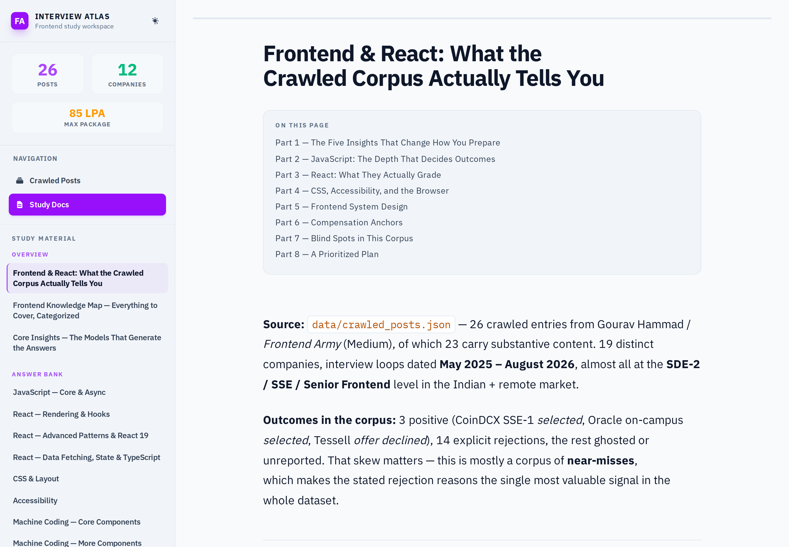
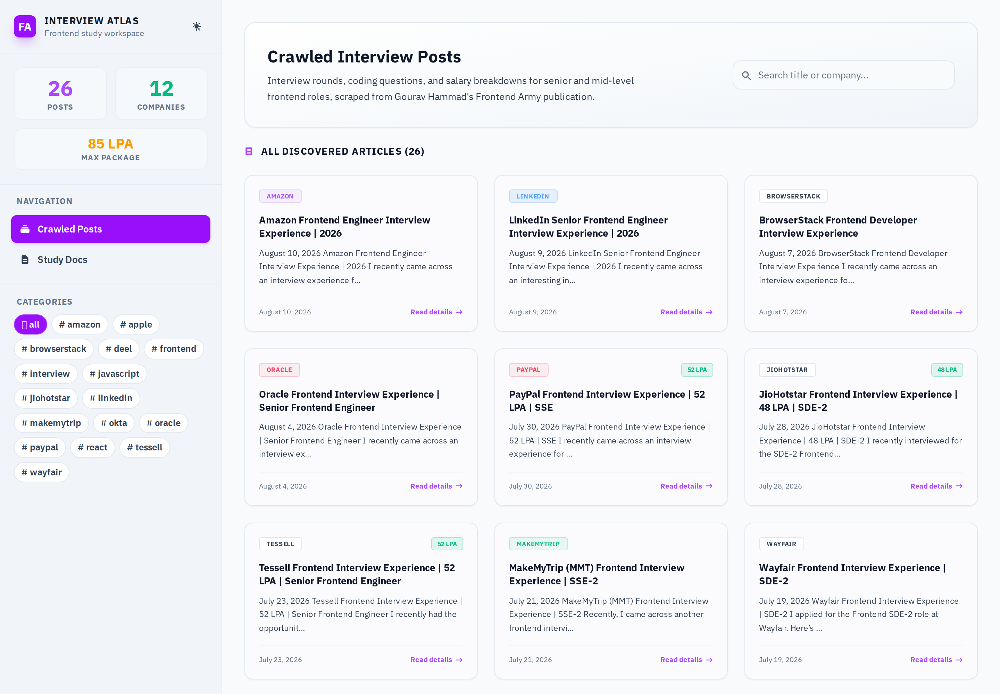

# Frontend Interview Atlas

A frontend interview knowledge base with its own ingestion pipeline: a Python/Node crawler pulls real interview-experience articles, and a React dashboard serves them alongside a large, hand-written study library — **23 documents, ~9,000 lines** — covering everything from the event loop to state machines.

The crawled corpus is one author's interview experiences, salary insights, and preparation strategies, published on Medium by **Gourav Hammad** (Founder of *Frontend Army*). The study library is built on top of it: some documents analyze what the corpus actually shows, most go well beyond it to cover what a senior frontend interview — and the job itself — actually needs. Every document says which is which; see [Study Material](#study-material).

<p align="center">
  
  
</p>

---

## What's in here

**A crawler.** RSS auto-discovery, Freedium-mirror paywall bypass, incremental re-crawling, on-demand crawling by URL — see [Crawler](#crawler).

**A dashboard.** Two views: a searchable, filterable grid of crawled posts with a full-article reader, and a Study Docs reader for the study library — sticky navigation, an auto-generated table of contents, syntax-highlighted code, light and dark themes, built to actually be read rather than skimmed.

**A study library.** Not a scrape dump — a genuine attempt at "what does a senior frontend engineer need to know," built in two layers: analysis of what the crawled interviews reveal (which questions repeat, which rejection reasons repeat, which topics decide outcomes), and full-depth reference material on everything the corpus doesn't cover, from TypeScript's type system to reading a memory heap snapshot to when *not* to reach for a state machine. Every document is explicit about which layer it's in — see the provenance table in [`docs/answers/README.md`](./docs/answers/README.md).

---

## Study Material

Read in this order:

| Document | What it is |
|---|---|
| [`docs/frontend-react-insights.md`](./docs/frontend-react-insights.md) | Analysis of the corpus — what 23 interview loops across 19 companies actually reveal, including which rejection reasons repeat |
| [`docs/frontend-knowledge-map.md`](./docs/frontend-knowledge-map.md) | Every concept to cover, in 21 categories across 6 layers, priority-marked by how much each decides outcomes |
| [`docs/core-insights.md`](./docs/core-insights.md) | The eight mental models that generate the answers, plus what an interview corpus structurally cannot teach |
| [`docs/answers/`](./docs/answers) | The library itself — 19 topic documents: JavaScript, React (×3), CSS, accessibility, machine coding (×2), system design, testing, security, production engineering, DSA, behavioural, TypeScript, build tooling, web platform APIs, performance tooling, state machines |

All of it renders in the dashboard's **Study Docs** view — sidebar navigation, table of contents, syntax highlighting — not just as raw files.

---

## Getting Started

### Run the dashboard

```bash
npm install
npm run build   # builds dashboard-react/ into dashboard-react/dist/
npm start        # Express server at http://localhost:3000
```

For frontend development with hot reload instead:

```bash
cd dashboard-react && npm install && npm run dev
```

### Run the crawler

Populates `data/crawled_posts.json` and `data/synthesized_knowledge.{json,md}`, which the dashboard's **Crawled Posts** view reads. Not included in this repo — see [Crawler](#crawler) below.

```bash
./run_crawler.sh                                    # full RSS re-sync
.venv/bin/python3 crawler.py "<medium-article-url>"  # one specific article
```

### Run the tests

```bash
npm test                                              # build + Node test runner + Python unit tests
node test/e2e/smoke.mjs http://localhost:3000         # Playwright E2E (needs a running, built server)
```

---

## Crawler

- **RSS Feed Auto-Discovery** — pulls the latest posts from the author's personal and publication feeds.
- **Freedium Mirror Bypassing** — maps Medium URLs to a Freedium mirror to read past the paywall and scrape clean Markdown.
- **Incremental** — caches results, only crawls what's new.
- **On-demand** — accepts a specific URL via CLI or the dashboard's Settings API and crawls just that one.

`data/*.json` is gitignored — the crawler writes full third-party article text, and that isn't republished here. Run the crawler yourself to populate it locally; `data/synthesized_knowledge.md` (short per-question excerpts and a salary table, not full articles) is the one output tracked in the repo.

---

## File Structure

```
crawler.py               Feed parsing, scraping, Markdown conversion, metadata extraction
run_crawler.sh            Sets up .venv, installs deps, runs crawler.py
knowledge-library.js      Builds the Codex-derived study library from crawled data
server.js                 Express API: crawled posts, docs, crawl trigger
test/
  server.test.js          Node test runner: API and docs-serving behaviour
  e2e/smoke.mjs            Playwright: dashboard rendering, typography, navigation
data/                      Crawler output (gitignored except synthesized_knowledge.md)
docs/                      The study library — see Study Material above
  answers/                 19 topic documents
  assets/                  README screenshots
dashboard-react/           React 19 + Vite + Tailwind v4 dashboard
  src/features/articles/    Crawled posts grid + reader modal
  src/features/docs/        Study Docs reader
  src/shared/                Markdown renderer, types, shared UI
```

---

## Tech Stack

**Crawler:** Python, BeautifulSoup4

**Server:** Node.js, Express

**Dashboard:** React 19, TypeScript, Vite, Tailwind CSS v4, React Router, react-markdown + remark-gfm + rehype-highlight

**Testing:** Node's built-in test runner, Playwright

---

## A note on the source material

The crawled corpus reflects one author's interview experiences in one market segment (India + remote, SDE-2/senior level, mid-2025–2026). Frequency counts and "what companies ask" claims in the analysis documents are evidence from that specific sample — real, but not universal. The study library says explicitly, document by document, which content is corpus-backed and which is added to complete the picture; the [provenance table](./docs/answers/README.md#where-each-topics-knowledge-comes-from) is the map.
